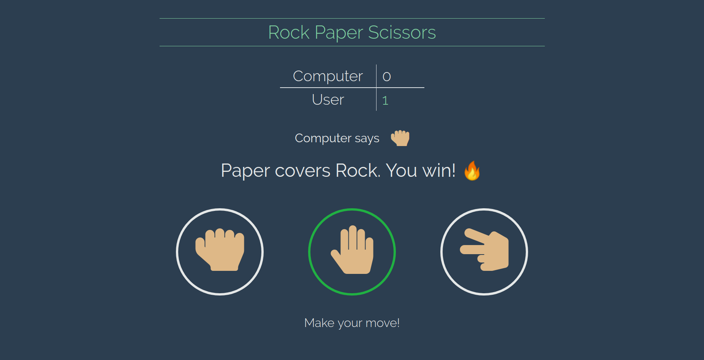

# Rock Paper Scissors

The classic rock paper scissors game developed in the functional programming language ELM.

<p align="center">
  
</p>

To use it, execute the command (elm 0.18 is necessary):
```
sh build.sh
```

Also you can try it online [here](https://lcambero.github.io/html/playground/rock-paper-scissors.html)


## Author

* **Luis Cambero** - [lcambero](https://github.com/lcambero)

## Last update

April 28, 2019

## License

This project is licensed under the MIT License - see the [LICENSE](LICENSE) file for details
